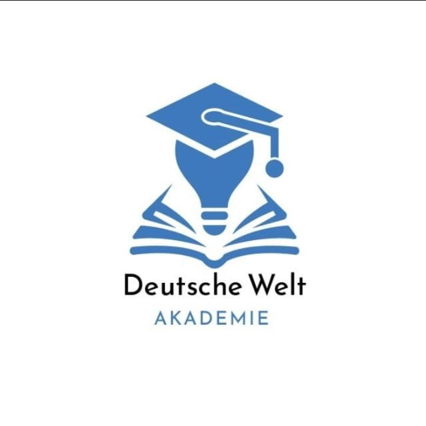

<div align="center">



# 🇩🇪 Deutsch Welt Akademie
### *منصة تعلّم اللغة الألمانية مع الهير خالد الحلواني*

<br/>

[](https://flutter.dev)
[](https://dart.dev)
[](https://bloclibrary.dev)
[](LICENSE)
[](https://flutter.dev)

<br/>

> **"اللغة الألمانية لم تكن أبدًا بهذه السهولة"**  
> منصة تعليمية متكاملة تجمع بين تجربة المستخدم الحديثة والمحتوى الأكاديمي عالي الجودة.

<br/>

[📱 Download App](#-getting-started) · [📖 Documentation](#-architecture) · [🐛 Report Bug](https://github.com/HEMASAMIR/Deutsh_welt_application/issues) · [✨ Request Feature](https://github.com/HEMASAMIR/Deutsh_welt_application/issues)

</div>

---

## 📋 Table of Contents

- [About The Project](#-about-the-project)
- [Key Features](#-key-features)
- [Tech Stack](#-tech-stack)
- [Architecture](#-architecture)
- [Project Structure](#-project-structure)
- [Getting Started](#-getting-started)
- [Screenshots](#-screenshots)
- [Roadmap](#-roadmap)
- [Contributing](#-contributing)
- [Contact](#-contact)

---

## 🎯 About The Project

**Deutsch Welt Akademie** هي منصة تعليمية متكاملة مبنية بـ Flutter، مُصمَّمة خصيصًا لطلاب اللغة الألمانية تحت إشراف **الهير خالد الحلواني** — أحد أبرز المتخصصين في تعليم اللغة الألمانية في العالم العربي.

المنصة تُقدّم تجربة تعليمية احترافية تشمل:
- 📹 **كورسات فيديو** منظّمة حسب المستويات (A1 → C2)
- 📚 **مكتبة كتب** تفاعلية ومُتاحة رقميًا
- 👤 **نظام إدارة مستخدمين** متكامل مع صلاحيات متعددة
- 📊 **لوحة تحكم طالب** تُظهر التقدم والإنجازات

---

## ✨ Key Features

| Feature | Description | Status |
|---|---|---|
| 🔐 **Authentication** | تسجيل دخول آمن مع Google Sign-In ودعم JWT | ✅ Done |
| 🎬 **Video Courses** | كورسات فيديو متعددة المستويات مع مشغّل مدمج | ✅ Done |
| 📚 **Books Library** | مكتبة كتب رقمية تفاعلية | ✅ Done |
| 💬 **Comments System** | نظام تعليقات على كل فيديو | ✅ Done |
| 👨‍💼 **Admin Dashboard** | إدارة الكورسات والمستخدمين والمستويات | ✅ Done |
| 📊 **Student Progress** | متابعة تقدم الطالب في كل مستوى | ✅ Done |
| 🗺️ **Branches Map** | خريطة تفاعلية لفروع الأكاديمية | ✅ Done |
| 🔔 **Notifications** | إشعارات محلية وفورية للطالب | ✅ Done |
| 🌐 **Localization** | دعم اللغة العربية والألمانية والإنجليزية | ✅ Done |
| 🎨 **Animations** | واجهة مستخدم احترافية مع Lottie & Animate Do | ✅ Done |
| 📶 **Offline Detection** | كشف الاتصال بالإنترنت في الوقت الفعلي | ✅ Done |
| 🔒 **Secure Storage** | تخزين آمن للبيانات الحساسة | ✅ Done |

---

## 🛠️ Tech Stack

### Core
```
Flutter 3.x  ·  Dart 3.x  ·  Material Design 3
```

### State Management
```
flutter_bloc ^8.1.6  ·  BLoC Pattern  ·  Cubit
```

### Networking & Backend
```
Dio ^5.7.0  ·  REST API  ·  Pretty Dio Logger  ·  Talker
```

### Architecture & DI
```
Clean Architecture  ·  GetIt ^8.0.2  ·  Dartz (Either)
```

### Storage
```
SharedPreferences  ·  Flutter Secure Storage
```

### Media & UI
```
Video Player  ·  Chewie  ·  Carousel Slider
WebView Flutter  ·  Lottie  ·  Shimmer
Google Fonts  ·  Font Awesome  ·  Animate Do
```

### Auth
```
Google Sign-In  ·  JWT Tokens
```

### Others
```
Connectivity Plus  ·  URL Launcher  ·  Local Notifications
Flutter Screen Util  ·  Equatable  ·  Formz
```

---

## 🏗️ Architecture

يعتمد المشروع على **Clean Architecture** بشكل كامل، مع فصل واضح بين الطبقات:

```
┌─────────────────────────────────────────────┐
│              Presentation Layer              │
│         (Views · Cubits · Widgets)          │
├─────────────────────────────────────────────┤
│               Domain Layer                  │
│      (Use Cases · Entities · Repos)        │
├─────────────────────────────────────────────┤
│                Data Layer                   │
│    (Models · API · Remote Data Sources)    │
└─────────────────────────────────────────────┘
```

### Design Patterns Used
- ✅ **BLoC / Cubit** — State Management
- ✅ **Repository Pattern** — Data abstraction
- ✅ **Dependency Injection** — via GetIt
- ✅ **Either Monad** — Functional error handling (Dartz)
- ✅ **Factory Pattern** — DI setup
- ✅ **Observer Pattern** — Stream-based state

---

## 📁 Project Structure

```
herr_khaled/
├── 📂 lib/
│   ├── 📂 core/                    # Shared core logic
│   │   ├── 📂 constants/           # App-wide constants
│   │   ├── 📂 cubit/               # Global cubits (theme, locale)
│   │   ├── 📂 di/                  # Dependency injection setup
│   │   ├── 📂 errors/              # Error handling & failures
│   │   ├── 📂 localization/        # Multi-language support (AR/DE/EN)
│   │   ├── 📂 network/             # Dio client & interceptors
│   │   ├── 📂 router/              # GoRouter / App navigation
│   │   ├── 📂 services/            # Notification & other services
│   │   ├── 📂 theme/               # App theme & typography
│   │   └── 📂 widgets/             # Reusable UI components
│   │
│   ├── 📂 features/                # Feature modules (Clean Arch)
│   │   ├── 📂 auth/                # Login, Register, Google Sign-In
│   │   │   ├── 📂 data/            # Models + Repos implementation
│   │   │   ├── 📂 domain/          # Entities + Repo interfaces
│   │   │   └── 📂 presentation/    # Views + Cubits + Widgets
│   │   │
│   │   ├── 📂 courses/             # Video courses by level
│   │   │   ├── 📂 data/
│   │   │   ├── 📂 domain/
│   │   │   └── 📂 presentation/    # Levels · Videos · Comments
│   │   │
│   │   ├── 📂 books/               # Digital books library
│   │   ├── 📂 home/                # Home screen + Drawer + Map
│   │   ├── 📂 dashboard/           # Student progress dashboard
│   │   ├── 📂 admin/               # Admin panel & controls
│   │   ├── 📂 user_management/     # User roles & group management
│   │   ├── 📂 profile/             # User profile management
│   │   └── 📂 splash/              # Animated splash screen
│   │
│   └── 📄 main.dart                # App entry point
│
├── 📂 assets/
│   ├── 📂 images/                  # App images & logo
│   ├── 📂 reviews/                 # Student review assets
│   └── 📂 videos/                  # Intro & promo videos
│
├── 📂 android/                     # Android native config
├── 📂 ios/                         # iOS native config
├── 📂 web/                         # Flutter Web config
└── 📄 pubspec.yaml                 # Dependencies
```

---

## 🚀 Getting Started

### Prerequisites

تأكد من توافر التالي على جهازك:

```bash
# Flutter SDK 3.x or higher
flutter --version

# Dart SDK 3.x or higher
dart --version

# Check everything is set up
flutter doctor
```

### Installation

```bash
# 1. Clone the repository
git clone https://github.com/HEMASAMIR/Deutsh_welt_application.git

# 2. Navigate to the project directory
cd Deutsh_welt_application

# 3. Install dependencies
flutter pub get

# 4. Run on your preferred platform
flutter run                  # Default device
flutter run -d chrome        # Web (Chrome)
flutter run -d android       # Android
flutter run -d ios           # iOS (macOS only)
```

### Build for Production

```bash
# Android APK
flutter build apk --release

# Android App Bundle (Play Store)
flutter build appbundle --release

# iOS (requires macOS + Xcode)
flutter build ios --release

# Web
flutter build web --release
```

---

## 📱 Screenshots

> *Coming soon — Stay tuned for UI previews!*

| Splash | Home | Courses |
|:---:|:---:|:---:|
| 🖼️ | 🖼️ | 🖼️ |

| Video Player | Books | Admin Panel |
|:---:|:---:|:---:|
| 🖼️ | 🖼️ | 🖼️ |

---

## 🗺️ Roadmap

- [x] Authentication System (Login / Register / Google)
- [x] Multi-level Video Courses
- [x] Books Digital Library
- [x] Admin Dashboard
- [x] Student Progress Tracking
- [x] Multi-language Support (AR / DE / EN)
- [x] Push Notifications
- [x] Certificate Generation System 🎓
- [ ] 🔜 AI-powered Grammar Checker
- [ ] 🔜 Live Sessions Integration
- [ ] 🔜 Gamification & Badges
- [ ] 🔜 Offline Mode for Downloaded Lessons

---

## 🤝 Contributing

هذا مشروع خاص. للاستفسار عن المشاركة أو التعاون، يُرجى التواصل مباشرة عبر القنوات الرسمية.

---

## 📞 Contact

<div align="center">

**Deutsch Welt Akademie**  
*مع الهير خالد الحلواني*

<br/>

[](https://wa.me/201055673184)
[](mailto:01055673184hs@gmail.com)
[](https://github.com/HEMASAMIR)

</div>

---

<div align="center">

**Built with ❤️ using Flutter**

*© 2026 Deutsch Welt Akademie — All Rights Reserved*

</div>
